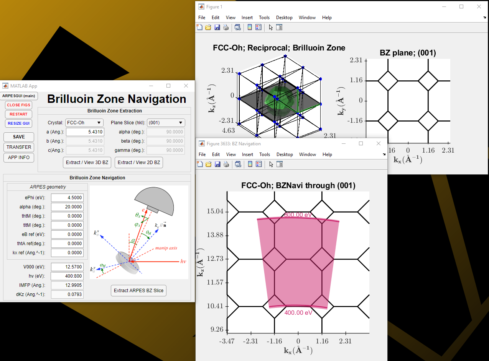
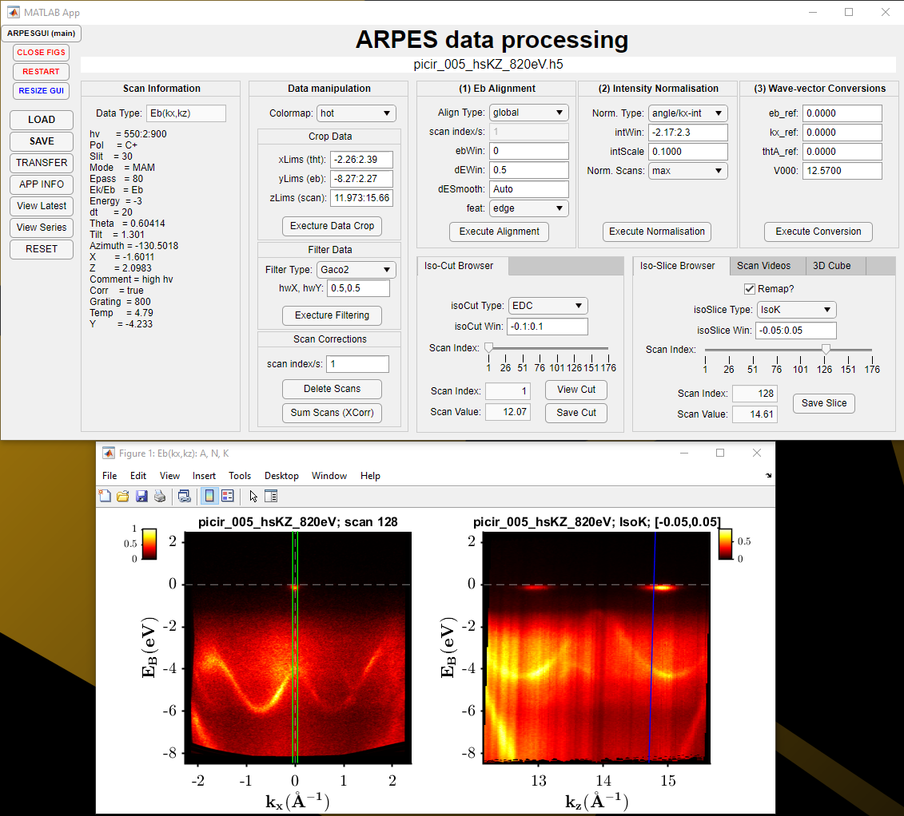
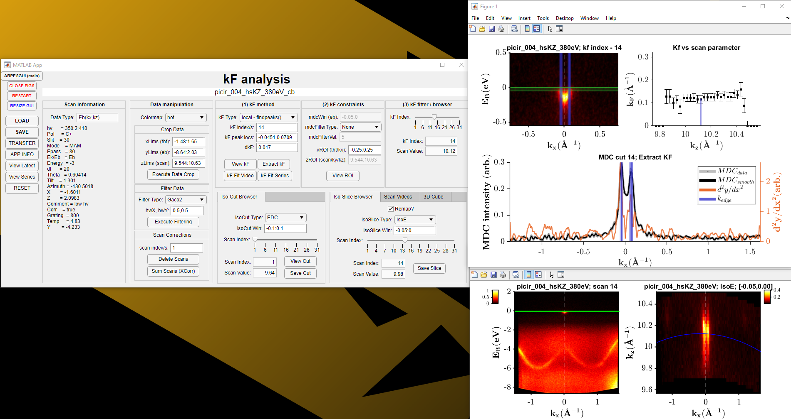
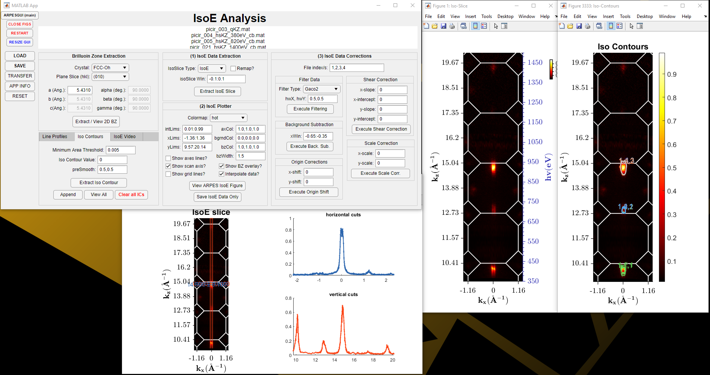
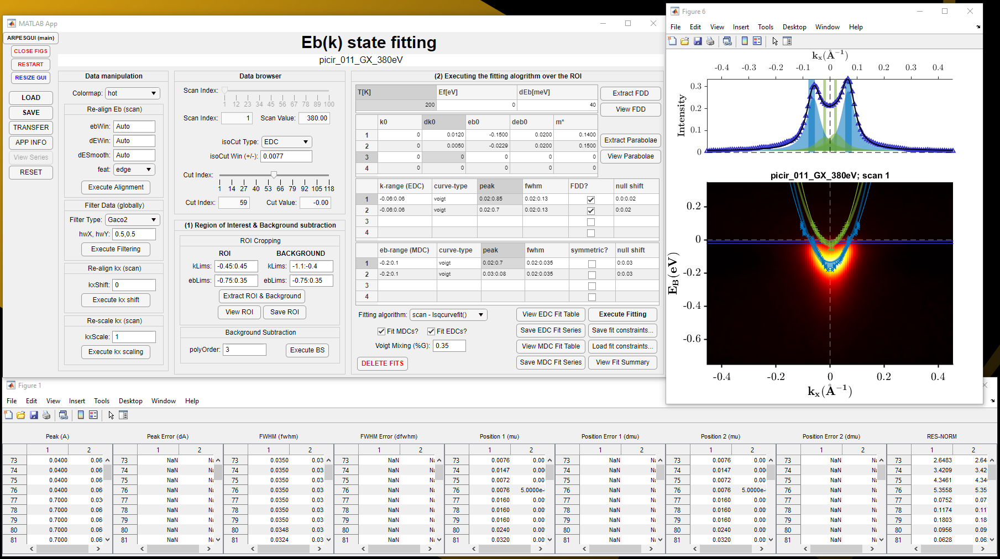
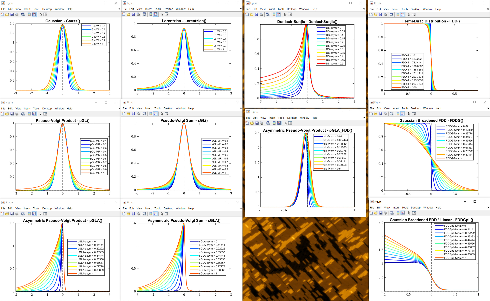
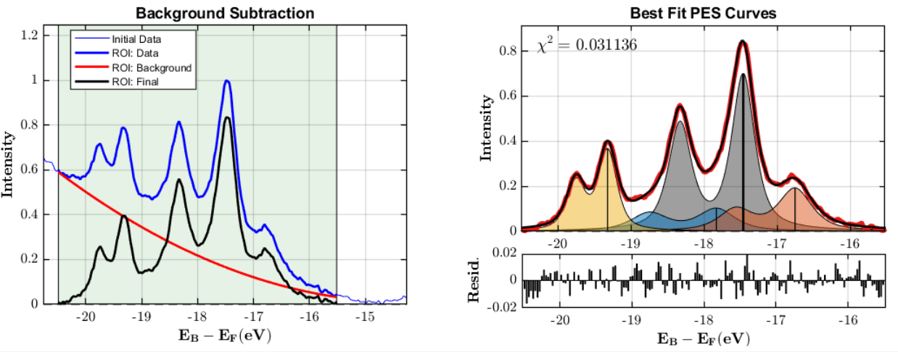

# ADRESSTools: Data analysis tools for SX-ARPES / XPS experiments at ADRESS

A compilation of MATLAB scripts used for the analysis of soft X-ray angle-resolved photoemission spectroscopy (SX-ARPES) experiments that give direct access to the electronic band-structure of a material. Designed to be directly compatible with the data format of SX-ARPES experiments at the ADRESS beamline, at the Swiss Light Source (SLS) in the Paul Scherrer Institute (PSI), but can be generalised to other data formats if required. The scripts can also be used for perform x-ray photoelectron spectroscopy (XPS) curve fitting, using a variety of background shapes.

## Installation  
1. Download the *ADRESSTools* repository.
2. Open MATLAB and use *Set Path* in the *Home* tab to add the *ADRESSTools* repository and all its sub-folders into its saved search paths.
3. Make sure you also use *Set Path* to add the repository / folder that contains all of your data to be loaded in.

In the *PESTools* folder, there is an *Examples* folder, which contains many ARPES / XPS data processing and curve fitting templates that can be used.

## ARPES Analysis tools
**ARPESGUI**:
The main menu for all ARPES analysis software in MATLAB, which allows the navigation to and from any piece of analysis UI. Accessible in MATLAB by typing 'ARPESGUI' in the command prompt.  

**BZ Navigation**:
Allows the user to define any crystal geometry and to determine the Wigner-Seitz cell in real-space and the First Brilluoin-Zone in reciprocal space. Additionally, by defining the crystal planes (100), (010) or (001), planar cuts through the stacked Brillouin-Zone can be determined, which is important in the interpretation of ARPES spectra. By imposing the ARPES geometry and experimental variables, the user can define the photon energy being used and extract the ARPES cut/slice being probed through the 2D Brillouin-Zone. This is very useful when it comes to finding what photon energies are needed to probe certain high-symmetry lines or valleys.

**ARPES Data Processing**:
Allows the user to walk through all of the processing steps that are required for analysing ARPES spectra, along with several miscellaneous tools that can crop, filter or correct the variables and data associated with the ARPES spectra. The 1st stage is to align the binding energies to the valence band maximum (or Fermi-edge), the 2nd is to normalise the intensity of the ARPES spectra over the scan parameter and the 3rd and final step is to convert the angles into wave-vectors.  

**kF Analysis**:
Allows the user to determine how Kf varies as a function of either the photon energy or tilt angle. This is important when it comes to finding out whether a state is behaving with 2D or 3D characteristics. Can also be used to track how the width of a feature changes as a function of a scan parameter.  

**IsoE Analysis**:
Allows the user to load in single or multiple processed ARPES data-files so that a consistent iso-energetic map can be created even across multiple data-files (if scans were segmented, rather than a single whole scan). The 2D Brillouin-Zone slice can be defined and overlaid on top of the iso-energetic slice. Multiple corrections can also be performed; filtering, background subtraction, origin, shear and scale corrections. There is also the option to determine the area over some threshold, so that the Luttinger Area can be determined to estimate the number density of electrons that are occupying the states.  

**Eb(k) State Fitting**:
Allows the user to walk through all of the fitting steps to parabolic features within ARPES spectra. The 1st stage is to load in the ARPES data, and perform any pre-fitting corrections (energy re-alignment, resampling, filtering and cropping). The 2nd stage is to crop around the region of interest and also some reference background with the same density of points. The option for polynomial background subtraction is also available using the reference background. The 3rd stage is to the perform the fitting to the parabolic feature using several different approaches and routines. The Fermi-Dirac distribution can be defined and used within the fitting constraints. A parabolic approximation can be set, whose parabolic trail can be used as a constraint to the fitting parameters to allow the solution to converge easier. Various constraints can also be placed on EDC and MDC cuts through the region of interest, but through trial-and-error, the best solution can be found.  

## XPS Analysis tools
**PES Model Curves**:
A whole suite of PES model curves are defined and available for the user to use within MATLAB. From Gaussian, Lorentzian, or Voigt to Doniach-Sunjic curve shapes. Furthermore, the Fermi-Dirac Distribution (FDD) is also defined, as well as its Gaussian broadened and linear background form. Combining all of these together, the fundamental curve-shapes for PES curve fitting to XPS / ARPES data is possible.

**PES Curve Fitting**:
The PESTools functions offer a host of different line-shapes and background that you can use for fitting XPS spectra. Here is a line of all available functions; (i) For PES curves: Gaussian, Lorentzian, Voigt, asymmetrical Voigt and Doniach-Sunjic functions are available; (ii) For Backgrounds: Linear, Shirley and Offset Shirley functions are available. The general objective of fitting XPS data is to define an initial photoelectron spectrum that provides a reasonable first guess and then run an optimisation procedure to hone in to the best fit solution. Here, the general procedures are listed below;  
(1) Define the shape and properties of the N primary (+ spin-orbit if required) components to be fitted  
(2) Define the type of background to be used  
(3) Preview the initial conditions of the XPS curve fit model vs data  
(4) If you are happy with the initial guess, use 'xps_solver()' to run the optimisation algorithm  
(5) Extract the best fit variables of the converged fit and plot the residuals  

**PES Multilayer Modelling**:
We define function that allows the user simulate the photoelectron intensity contributions of an N-layered sample as a function of photon energy. This can be used to model experimental data obtained at ADRESS. The function allows the user to define the material type of each layer, the thickness, the core-level being probed and then determines the emitted photoelectron intensity of each layer using the Beer-Lambert law. All the material, photoionisation and core-level parameters are stored within Materials Database Tools.

## Materials Database Tools
**(1) Electron Inelastic Mean Free Path Database (eIMFPD)**: This is a local MATLAB database that compiles the optical data from the NIST Electron Inelastic-Mean-Free-Path Database (http://dx.doi.org/10.18434/T48C78) so that the results can be easily called and accessed within MATLAB. Furthermore, eIMFP calculators are also available using the TPP2M or Universal formalism. Accessible in MATLAB via 'get_eimfpd_props()'.

**(2) Material Properties Database (MPD)**: This is a local MATLAB database that compiles the most useful physical, electronic, optical and magnetic material properties of elements / compounds. The data is taken from a range of sources, where the 'average' values are used for parameters that had more than 1 unique value. Accessible in MATLAB via 'get_mpd_props()'.

**(3) Photoionisation Cross-Section and Asymmetry Database (PIXSAD)**:
This is a local MATLAB database that compiles the photoionisation cross-section and asymmetry parameter data of the elements. This is useful when modelling the total photoelectron intensity that originates from a given layer of a sample when performing ARPES / XPS experiments. Accessible in MATLAB via 'get_pixsad_props()'.

**(4) Photoionisation Energy and Fluorescence Database (PIEFD)**:
This is a local MATLAB database that compiles the photoionisation energy and fluorescence yield data of the elements. Accessible in MATLAB via 'get_piefd_props()'.

## MATLAB Version control  
MATLAB version:   2020a  
MATLAB add-ons (recommended):   Global Optimization Toolbox, Curve Fitting Toolbox, Parallel Processing Toolbox.

## Authors
MaterialsDatabase & PESTools Scripts:  
**Procopios Constantinou**,  
Swiss Light Source (SLS),  
Paul Scherrer Institute (PSI),  
email: procopios.constantinou@psi.ch

MATools Scripts:  
**Vladimir Strocov**,  
Swiss Light Source (SLS),  
Paul Scherrer Institute (PSI),  
email: vladimir.strocov@psi.ch

## License  
This project is licensed under the GNU General Public License v3.0 - see the [LICENSE.md](LICENSE.md) file for details.

--PCC November 2021
